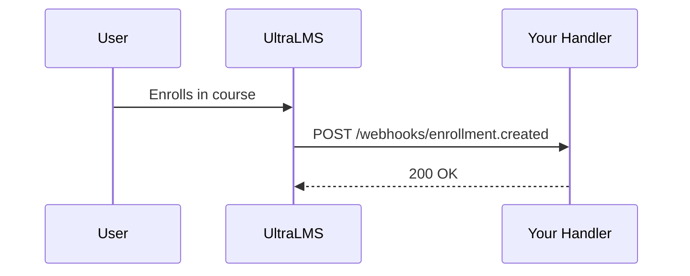

## Overview

UltraLMS integrates seamlessly with popular payment processors, custom domains, and provides a full REST API plus webhooks for advanced extensions. Use Stripe or Razorpay for payments, host on your domain, query data via API, and react to events with webhooks.

<Columns cols={2}>
  <Card title="Payments" icon="credit-card" href="#payments">
    Accept payments via Stripe or Razorpay directly in your academy.
  </Card>
  <Card title="Custom Domains" icon="globe" href="#domains">
    Run your academy on academy.yourdomain.com.
  </Card>
  <Card title="REST API" icon="code" href="#api">
    Full CRUD access to courses, users, and enrollments.
  </Card>
  <Card title="Webhooks" icon="zap" href="#webhooks">
    Real-time notifications for events like new enrollments.
  </Card>
</Columns>

## Payments

Configure Stripe or Razorpay to handle checkouts, subscriptions, and one-time payments for your courses.

<Tabs>
  <Tab title="Stripe" icon="dollar-sign">

<Steps>
  <Step title="Create Stripe Account" icon="user-plus">
    Sign up at stripe.com and get your API keys from the dashboard.
  </Step>
  <Step title="Add Keys in UltraLMS" icon="settings">
    Go to Settings > Payments > Stripe. Enter your publishable key and secret key.
  </Step>
  <Step title="Test Checkout" icon="play">
    Create a course with price, then test purchase from the frontend.
  </Step>
</Steps>

<Callout kind="tip">
  Use test mode keys during development. Switch to live keys for production.
</Callout>

  </Tab>
  <Tab title="Razorpay" icon="inr">

<Steps>
  <Step title="Create Razorpay Account" icon="user-plus">
    Sign up at razorpay.com and activate payments.
  </Step>
  <Step title="Configure Webhooks" icon="settings">
    In UltraLMS Settings > Payments > Razorpay, add your key ID, key secret, and webhook secret.
  </Step>
  <Step title="Enable Subscriptions" icon="repeat">
    Toggle subscriptions in Razorpay dashboard, then sync in UltraLMS.
  </Step>
</Steps>

  </Tab>
</Tabs>

## Custom Domains

Host your academy on a custom subdomain like academy.yourdomain.com.

<Steps>
  <Step title="Add Domain in DNS" icon="globe">
    Add a CNAME record: academy points to ultralms.com.
  </Step>
  <Step title="Verify in UltraLMS" icon="check-circle">
    Go to Settings > Domains, enter your subdomain, and verify.
  </Step>
  <Step title="Update SSL" icon="shield">
    UltraLMS auto-provisions SSL. Test HTTPS access.
  </Step>
</Steps>

<Callout kind="info">
  Propagation takes up to 48 hours. Use tools like dig to check DNS.
</Callout>

## REST API

Access UltraLMS data programmatically. Base URL: `https://api.ultralms.com/v1`.

<Request tabs="JavaScript,cURL" show-lines="true">
  ```javascript
const response = await fetch('https://api.ultralms.com/v1/courses', {
  headers: {
    'Authorization': 'Bearer YOUR_API_KEY',
    'Content-Type': 'application/json'
  }
});
const courses = await response.json();
  ```
  ```bash
curl -X GET https://api.ultralms.com/v1/courses \
  -H "Authorization: Bearer YOUR_API_KEY" \
  -H "Content-Type: application/json"
  ```
</Request>

<Response tabs="200">
```json
{
  "courses": [
    {
      "id": "course_123",
      "title": "Watercolour Landscapes",
      "lessons": 24,
      "price": 99
    }
  ],
  "meta": {
    "total": 1,
    "page": 1
  }
}
```
</Response>

<ParamField path="course_id" param-type="string" required="true">
  Unique course identifier.
</ParamField>

<ResponseField name="id" field-type="string" required="true">
  Course ID.
</ResponseField>

<ResponseField name="title" field-type="string">
  Course title.
</ResponseField>

## Webhooks

Receive real-time events like `enrollment.created` or `payment.succeeded`.



<CodeGroup tabs="Node.js,Python">
```javascript
const express = require('express');
const app = express();
app.use(express.raw({type: 'application/json'}));

app.post('/webhooks/ultralms', (req, res) => {
  const sig = req.headers['x-ultralms-signature'];
  // Verify signature with WEBHOOK_SECRET
  console.log('Event:', req.body);
  res.status(200).send('OK');
});
```
```python
from flask import Flask, request
app = Flask(__name__)

@app.route('/webhooks/ultralms', methods=['POST'])
def webhook():
    signature = request.headers.get('X-UltraLMS-Signature')
    # Verify with WEBHOOK_SECRET
    event = request.get_json()
    print(f"Event: {event}")
    return 'OK', 200
```
</CodeGroup>

<Callout kind="alert">
  Always verify webhook signatures using your secret to prevent replay attacks.
</Callout>